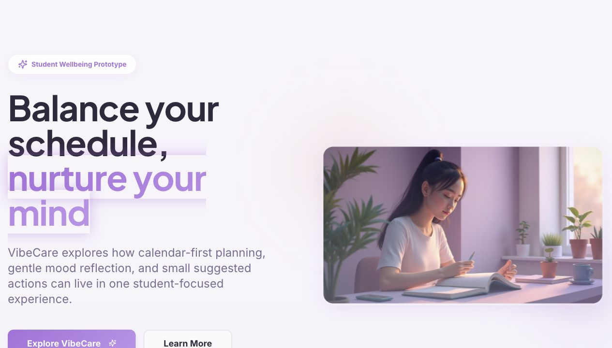
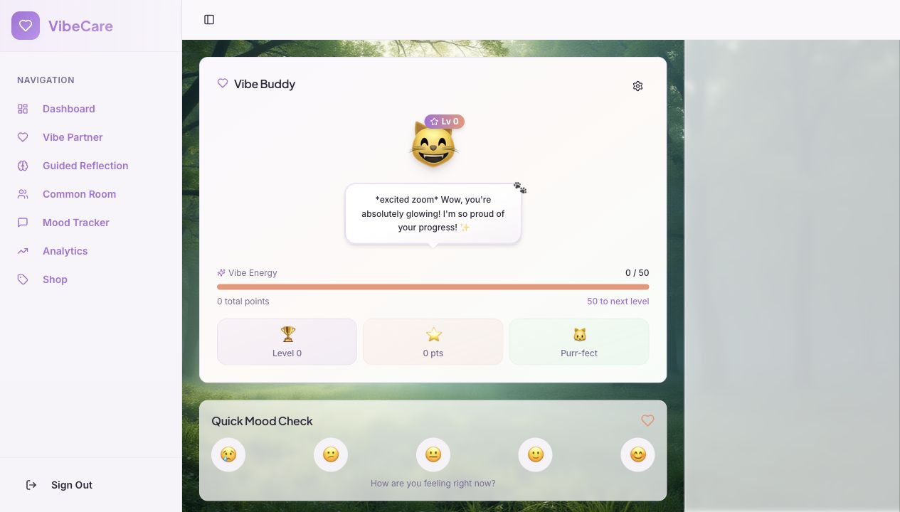
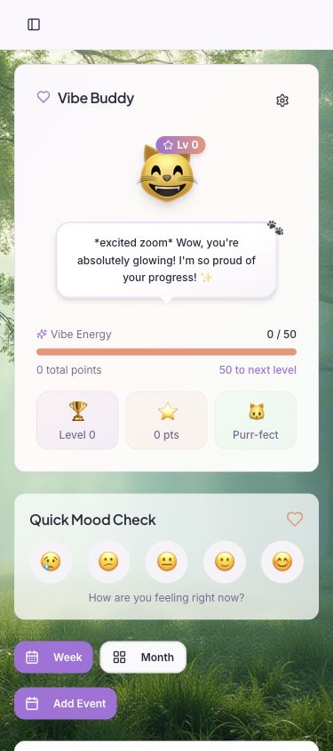
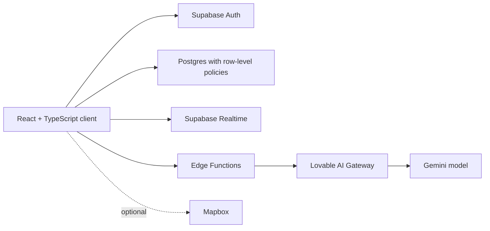

# VibeCare

**A student-wellbeing product prototype that brings planning, reflection, peer connection, and AI-guided check-ins into one gentle daily experience.**



[View the source](https://github.com/tyh007/vibecare) · [Original collaborative repository](https://github.com/tyh007/vibe-care-buddy)

> VibeCare is a portfolio prototype, not a medical product, therapist, crisis service, or substitute for professional care.

## Case study

University life asks students to manage academic pressure, personal routines, social connection, and emotional wellbeing across tools that rarely speak to one another. VibeCare explores a more coherent experience: a calendar-first workspace where lightweight mood reflection and support appear in the context of a student's actual day.

The project began as a rapid collaborative build. This repository is a carefully reconstructed portfolio edition: the strongest product direction is preserved, duplicate experiments and exposed configuration are removed, and the implementation is documented with clearer safety and privacy boundaries.

### My role

**Product Designer + Frontend Developer**

- Shaped the calendar-first product concept and key user flows.
- Designed and implemented the responsive React interface.
- Integrated mood reflection, planning, avatar rewards, and AI-assisted experiences.
- Reworked the original prototype into a safer, reproducible portfolio repository.

### Collaboration

VibeCare was created with a teammate.

> **Credit placeholder:** add collaborator name, portfolio/GitHub link, and precise contribution summary before presenting this case study as final.

The original collaboration and commit record remain available in [`tyh007/vibe-care-buddy`](https://github.com/tyh007/vibe-care-buddy).

## Product direction

The design is built around three principles:

1. **Meet students inside their routine.** Wellbeing actions are connected to calendar context rather than isolated in another tracker.
2. **Keep reflection lightweight.** Check-ins use small prompts, visible trends, and manageable next steps.
3. **Make support boundaries obvious.** AI can guide reflection and assist moderation, but must not present itself as diagnosis, treatment, professional care, or reliable crisis monitoring.

## Experience highlights

| Area | Product intent |
| --- | --- |
| Dashboard and calendar | Combine schedule awareness, notes, suggested activities, and daily mood context. |
| Mood reflection | Capture a check-in and explore patterns across time, routine, and location. |
| Vibe Partner | Offer a customizable conversational companion for brief, supportive prompts. |
| Guided reflection | Walk through CBT-informed questions without claiming clinical authority. |
| Community Room | Explore peer connection with authenticated posting and fallible AI-assisted moderation. |
| Avatar rewards | Use lightweight progression and customization to encourage repeat engagement. |





## Architecture



The frontend is a Vite application using React, TypeScript, Tailwind CSS, shadcn/ui, TanStack Query, Recharts, and Mapbox GL. Supabase provides authentication, persistence, realtime updates, database policies, migrations, and Edge Functions.

Routes are lazy-loaded and larger chart, map, and Supabase dependencies are split into separate production chunks.

## Safety & privacy

- Edge Functions require a valid Supabase JWT.
- Community moderation verifies that the authenticated user matches the submitted user ID before any service-role update.
- AI inputs are length-limited, and conversation history is constrained before gateway requests.
- Missing moderation is reported as degraded service rather than silently described as successful review.
- Product copy avoids unsupported claims about confidentiality, encryption, professional credentials, diagnosis, treatment, or guaranteed crisis detection.
- The included database policies should be reviewed and tested before real personal data is used.

For crisis support in the United States, call or text [988](https://988lifeline.org/). For immediate danger, contact local emergency services. Outside the U.S., use an appropriate local crisis service.

## Local setup

### Prerequisites

- Node.js 20 or newer
- [pnpm](https://pnpm.io/)
- A Supabase project
- Access to a compatible AI gateway for the included Edge Functions

### 1. Install

```bash
git clone https://github.com/tyh007/vibecare.git
cd vibecare
pnpm install
```

### 2. Configure the client

```bash
cp .env.example .env
```

Add the public client values from Supabase:

```dotenv
VITE_SUPABASE_URL=https://your-project.supabase.co
VITE_SUPABASE_PUBLISHABLE_KEY=your-publishable-key
VITE_MAPBOX_TOKEN=optional-mapbox-token
```

Without the two Supabase values, VibeCare shows an actionable configuration screen instead of crashing.

### 3. Configure Supabase

1. Link the project with the Supabase CLI.
2. Apply the SQL files in `supabase/migrations/`.
3. Configure `LOVABLE_API_KEY` for the current Edge Function gateway, or adapt the functions to another provider.
4. Deploy `vibe-partner-chat`, `cbt-therapist-chat`, and `moderate-message`.

The legacy function and route name `cbt-therapist-chat` is retained for migration compatibility; the user-facing experience is called **Guided Reflection**.

### 4. Run

```bash
pnpm dev
```

Open `http://127.0.0.1:8080`.

## Quality checks

```bash
pnpm typecheck
pnpm lint
pnpm build

# or run the complete verification sequence
pnpm check
```

## Repository reconstruction

This repository was rebuilt from the root application at source commit [`d2fc278`](https://github.com/tyh007/vibe-care-buddy/commit/d2fc278f329c99122b81865341849fb180a2beef).

The original repository is intentionally untouched. Its Git history was not imported because it contains committed environment files, a second divergent application, and unrelated notebook material. This portfolio edition begins with a new sanitized history while preserving the provenance link above.

## Limitations

- Backend configuration is required; there is no mock-data fallback for authentication or server features.
- The AI gateway configuration reflects the original prototype and may require adaptation.
- Automated moderation is probabilistic and cannot guarantee safety.
- The onboarding support-contact screen demonstrates a concept and does not contact anyone automatically.
- The product has not undergone clinical validation, formal security review, or production privacy assessment.
- Automated end-to-end and database policy tests remain future work.

## Status and usage

This repository is published for portfolio review and technical discussion. No open-source license has been added because contributor authorization has not yet been confirmed. All rights remain with the respective contributors unless a license is added later.
